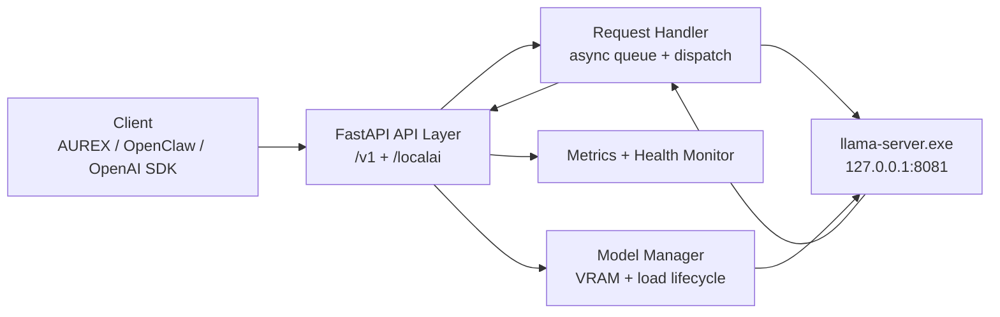

<div align="center">
  <h1>LocalAi</h1>
  <p><strong>Windows-first local inference fabric for llama.cpp with an OpenAI-compatible API</strong></p>
  <p>
    <code>FastAPI</code>
    <code>llama-server.exe</code>
    <code>CUDA / NVIDIA VRAM aware</code>
    <code>SSE streaming</code>
    <code>OpenAI SDK compatible</code>
  </p>
</div>

```text
+--------------------------------------------------------------------------------+
|  LOCALAI                                                                       |
|  Local-first inference control plane for Windows                               |
|                                                                                |
|  Clients             Queue              Runtime               Telemetry        |
|  OpenClaw            async FIFO         llama-server.exe      /health          |
|  AUREX               single worker      model lifecycle       /localai/status  |
|  OpenAI SDK          SSE / JSON         VRAM decisions        /localai/metrics |
+--------------------------------------------------------------------------------+
```

## Overview

LocalAi is a production-ready local inference server built for Windows systems running `llama.cpp`. It provides one stable API surface in front of local models, GPU-aware loading, request queueing, live health reporting, structured logs, and OpenAI-compatible chat/completion endpoints.

The design goal is simple: local clients should switch from a remote provider to LocalAi by changing only `base_url` and model name, without rewriting request payloads.

## Why LocalAi

- One local API for multiple installed model variants
- OpenAI-compatible request and response shapes
- SSE streaming support for chat and completions
- GPU-aware loading decisions based on live VRAM
- Clean Windows process lifecycle for `llama-server.exe`
- Structured logs, runtime metrics, and health monitoring
- Admin endpoints for load, unload, status, metrics, and shutdown

## System View



## Current State

| Area | Status |
| --- | --- |
| Phase 1 - Foundation | Complete |
| Phase 2 - Core API | Complete |
| Phase 3 - Intelligence | Complete |
| Release | `v1.0.0` |

## Installed Models

Current installed model IDs:

- `qwen3.5-4b-q4_k_m`
- `qwen3.5-4b-q8_0`
- `qwen3.5-9b`

Current layout:

```text
models/
|- qwen3.5-4b-q4_k_m/
|  |- model.config.json
|  |- weights/Qwen3.5-4B-Q4_K_M.gguf
|  `- vision/mmproj-4B-BF16.gguf
|- qwen3.5-4b-q8_0/
|  |- model.config.json
|  |- weights/Qwen3.5-4B-Q8_0.gguf
|  `- vision/mmproj-4B-BF16.gguf
`- qwen3.5-9b/
   |- model.config.json
   |- weights/Qwen3.5-9B-Q4_K_M.gguf
   `- vision/mmproj-9B-BF16.gguf
```

Notes:

- The two 4B variants share the same `mmproj-4B-BF16.gguf` payload via hard link.
- Discovery is model-folder based, not root-folder `.gguf` based.
- `model_id`, folder name, and `model.config.json` must match exactly.

## API Surface

### Core endpoints

| Method | Path | Purpose |
| --- | --- | --- |
| `GET` | `/health` | Lightweight runtime health, queue depth, VRAM summary |
| `GET` | `/v1/models` | OpenAI-compatible model listing |
| `GET` | `/v1/models/{model_id}` | OpenAI-compatible model details with fuzzy resolution |
| `POST` | `/v1/chat/completions` | Chat completions, JSON or SSE streaming |
| `POST` | `/v1/completions` | Raw completions, JSON or SSE streaming |

### Admin endpoints

| Method | Path | Purpose |
| --- | --- | --- |
| `GET` | `/localai/status` | Full runtime summary |
| `GET` | `/localai/metrics` | VRAM, queue, uptime, per-model request stats |
| `POST` | `/localai/models/load` | Load a discovered model |
| `POST` | `/localai/models/unload` | Unload the active model |
| `POST` | `/localai/shutdown` | Graceful application shutdown |

## OpenAI Compatibility

LocalAi is compatible with the OpenAI Python SDK and OpenAI-style HTTP clients.

Supported behavior:

- OpenAI-style chat/completion request bodies
- OpenAI-style error envelope
- OpenAI-style model listing
- extra request fields forwarded to `llama-server`
- `None` values stripped before dispatch so `llama-server` does not reject payloads
- SSE streaming for `stream=true`

Error envelope format:

```json
{
  "error": {
    "message": "...",
    "type": "...",
    "code": "..."
  }
}
```

Minimal SDK example:

```python
from openai import OpenAI

client = OpenAI(
    base_url="http://127.0.0.1:8080/v1",
    api_key="localai",
)

response = client.chat.completions.create(
    model="qwen3.5-4b-q4_k_m",
    messages=[
        {"role": "system", "content": "Answer concisely."},
        {"role": "user", "content": "What is LocalAi?"},
    ],
    max_tokens=128,
)

print(response.choices[0].message.content)
```

## Quick Start

### 1. Environment

```powershell
cd C:\LocalAi
python -m venv venv
.\venv\Scripts\activate
pip install -r requirements.txt
```

### 2. Runtime binaries

Place the `llama.cpp` Windows CUDA runtime in [bin](/c:/LocalAi/bin):

- `llama-server.exe`
- `ggml-*.dll`
- CUDA runtime DLLs required by your build
- keep [bin/version.txt](/c:/LocalAi/bin/version.txt) updated

### 3. Start the server

```powershell
.\start.ps1
```

### 4. Load a model

```powershell
curl -X POST http://localhost:8080/localai/models/load `
  -H "Content-Type: application/json" `
  -d '{"model_id": "qwen3.5-4b-q4_k_m"}'
```

### 5. Send an inference request

```powershell
curl -X POST http://localhost:8080/v1/chat/completions `
  -H "Content-Type: application/json" `
  -d '{
    "model": "qwen3.5-4b-q4_k_m",
    "messages": [{"role": "user", "content": "Say hello."}],
    "max_tokens": 64,
    "chat_template_kwargs": {"enable_thinking": false}
  }'
```

### 6. Stop the server

```powershell
.\stop.ps1
```

## Runtime Flow

```text
Client request
  -> FastAPI endpoint
  -> RequestHandler enqueue
  -> llama-server.exe
  -> JSON or SSE response
  -> metrics + logs updated
```

## Observability

LocalAi ships with runtime visibility built in.

### Health

`GET /health` returns:

- service status
- version
- whether a model is loaded
- live VRAM used / total
- current queue depth

### Status

`GET /localai/status` returns:

- engine state and PID
- loaded model details
- current VRAM snapshot
- queue state
- uptime
- health monitor status

### Metrics

`GET /localai/metrics` returns:

- uptime
- server version
- VRAM used/free/total
- queue depth and totals
- per-model request count
- per-model error count
- per-model average latency
- last-used timestamp per model

### Logging

Structured logs are written to [logs/localai.log](/c:/LocalAi/logs/localai.log).

Logging design:

- colored human-readable console output
- JSON log file output
- rotating daily log file
- request lifecycle logging
- VRAM snapshot logging

## Helper Scripts

| Script | Purpose |
| --- | --- |
| [start.ps1](/c:/LocalAi/start.ps1) | Start LocalAi in the background |
| [stop.ps1](/c:/LocalAi/stop.ps1) | Graceful shutdown through API |
| [status.ps1](/c:/LocalAi/status.ps1) | Quick runtime status summary |
| [validate_models.ps1](/c:/LocalAi/scripts/validate_models.ps1) | Verify `.gguf` files against `.sha256` sidecars |
| [add_model.ps1](/c:/LocalAi/scripts/add_model.ps1) | Register a new already-downloaded model scaffold |
| [migrate_aurex.ps1](/c:/LocalAi/scripts/migrate_aurex.ps1) | Generate AUREX migration guidance and helper client |
| [test_aurex_connection.py](/c:/LocalAi/scripts/test_aurex_connection.py) | Validate OpenAI SDK compatibility end to end |

## Configuration

Primary config file: [localai.config.json](/c:/LocalAi/localai.config.json)

Key defaults:

| Setting | Default |
| --- | --- |
| API host | `127.0.0.1` |
| API port | `8080` |
| llama-server port | `8081` |
| request timeout | `120` seconds |
| max queue depth | `20` |
| VRAM safety margin | `300 MB` |
| runtime overhead estimate | `200 MB` |
| log directory | `logs` |

## Repository Layout

```text
C:\LocalAi
|- server/
|  |- api/       OpenAI-compatible and admin endpoints
|  |- config/    Pydantic schemas and config loader
|  |- core/      Engine, queue, model, VRAM, monitor, metrics logic
|  `- utils/     Logging, checksum, GPU, and process helpers
|- models/       Per-model folders and configs
|- bin/          llama.cpp runtime binaries
|- logs/         JSON runtime logs
|- data/         PID and runtime state files
|- scripts/      Helper scripts and SDK compatibility test
|- start.ps1
|- stop.ps1
`- status.ps1
```

## Requirements

| Component | Requirement |
| --- | --- |
| OS | Windows 11 recommended |
| Python | 3.11+ |
| GPU | NVIDIA GPU supported by `pynvml` |
| Inference backend | `llama-server.exe` from `llama.cpp` |
| RAM | 8 GB minimum, 16 GB+ recommended |
| VRAM | Depends on selected model variant |

## Current Limitations

- A model must be loaded before inference requests can succeed.
- Runtime binaries from `llama.cpp` are not shipped in this repo and must be placed in `bin/` manually.
- Windows is the primary target environment.

## Development Notes

- Always use the project virtual environment.
- Always run from `C:\LocalAi`.
- Always use `uvicorn.Config(app=app, ...)`, never string-form app loading under `python -m`.
- Model binaries, runtime DLLs, `.gguf`, and similar artifacts are intentionally ignored by Git.

## License

MIT
